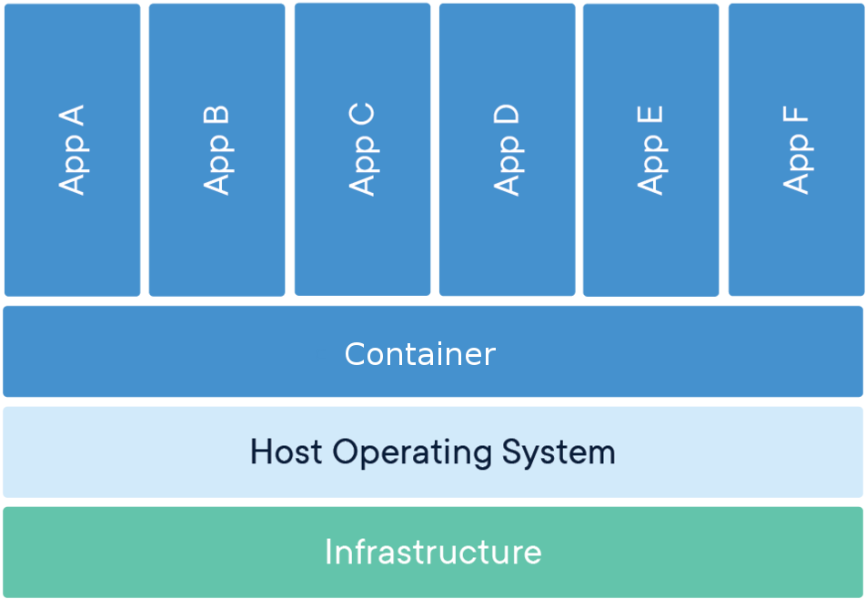

---?image=img/first_slide.png

@snap[north-west]
<h2>How to use singularity in a HPC environment</h2>
<b>Author:</b> Henric Zazzi, PDC Center for High Performance Computing
@snapend

---

## Overview

- What are containers
- Docker, the most popular container
- Singularity: Containers for the HPC environment
- installation of singularity
- Using the container
- How to build containers
- Running your container in an HPC environment
- Creating recipes for singularity

---

## What are containers


---

@snap[north-west]
A container image is a lightweight, standalone, executable package of
software that includes everything needed to run an application.
@snapend

@snap[south-west size40 border-image]
Virtual Machine<br>

@snapend

@snap[south-east size40 border-image align-left]
Container<br>

@snapend

---

## Containers: How are they useful

- Reproducibility
- Portability
- Depending on application and use-case, simple extreme scalability
- Next logical progession from virtual machines

---

Docker, the most popular container

---

## The Docker container software

- The most know container software
- Facilites workflow for creating, maintaining and distributing software
- Used by many scientist
- high reproducible
- @color[red](Not used on HPC clusters)

---

## Docker on HPC: The problem

- Docker users can escalate to root access on the cluster
- No native GPU support
- No support for MPI
- Incompabilities with scheduling managers

---

## Singularity: Containers for the HPC environment

- No need for modules
- Package software and dependencies in one file
- Use same container in different SNIC clusters
- Limits	user’s	privileges,	security	contexts
- Compatible with Docker images https://hub.docker.com/explore/
- Negligable performance decrease

---

## Install singularity in Linux

```
$ VERSION=X.X.X
$ sudo apt-get update
$ sudo apt-get install libarchive-dev
$ sudo apt-get install squashfs-tools
# Get and install
$ wget https://github.com/singularityware/singularity/releases/
download/$VERSION/singularity-$VERSION.tar.gz
$ tar xvf singularity-$VERSION.tar.gz
$ cd singularity-$VERSION
$ ./configure --prefix=/usr/local
$ make
$ sudo make install
```

For Mac or Windows, follow instructions at https://www.sylabs.io/guides/2.6/user-guide/installation.html

---

## Singularity hub

https://singularity-hub.org/
@snap[with-border]

@snapend

---

@snap[north-west]
<h2>Singularity workflow</h2>
@snapend

@snap[west with-border]
Create container<br>
@color[#62922e](singularity build)<br>
Install software<br>
Install libraries<br>
@snapend

@snap[kthblue]
@fa[arrow-right fa-4x]
@snapend

@snap[east align-left with-border]
@color[#62922e](singularity shell)<br>
@color[#62922e](singularity exec)<br>
@color[#62922e](singularity help)<br>
@color[#62922e](singularity run)<br>
@snapend

---

Using the container

---

## Test singularity

Download and test the latest UBUNTU image from docker hub

```
$ sudo singularity build my_image.simg docker://ubuntu:latest
Docker image path: index.docker.io/library/ubuntu:latest
Cache folder set to /root/.singularity/docker
Importing: base Singularity environment
Building Singularity image...
Singularity container built: my_image.simg
$ singularity shell my_image.simg
Singularity: Invoking an interactive shell within container...
Singularity my_image.simg:~> cat /etc/*-release

```
@snap[red align-right]
@color[red](Do it yourself:)
@snapend

---

How to build containers

---

## Why must I be root?

Same permissions in the container as outside...

To be root in the singularity image you must be root on the computer

---

## Build a writeable image

Since there are memory limitation on writing directly to image file,
it is better to create a sandbox

```
$ sudo singularity build --sandbox my_sandbox my_image.simg
Building from local image: my_image.simg
Singularity container built: my_sandbox
$ sudo singularity shell -w my_sandbox
Singularity: Invoking an interactive shell within container...
Singularity my_sandbox:~>

```

---

## Transfer files into container

Folder path are on your local computer when in read-mode whereas
in your container when in write-mode

---

## How to transfer files into the container

```
sudo singularity exec -w my_sandbox mkdir singularity_folder
sudo singularity shell --bind my_folder:/root/singularity_folder -w ubuntu_write/
cp singularity_folder/my_files .
```

---

## How do I execute commands in singularity

Commands in the container can be given as normal as long as the path
are right.

```
singularity exec my_image.simg ls
```
```
$ singularity shell my_image.simg
Singularity: Invoking an interactive shell within container...
Singularity my_image.simg:~> ls
```

---

## singularity.d folder

```
$ singularity exec my_image.simg ls -l /.singularity.d
total 1
drwxr-xr-x 2 root root  76 Sep 11 17:05 actions
drwxr-xr-x 2 root root 139 Sep 11 17:23 env
drwxr-xr-x 2 root root   3 Sep 11 17:05 libs
-rwxr-xr-x 1 root root  33 Sep 11 17:23 runscript
-rwxr-xr-x 1 root root  10 Sep 11 17:05 startscript
```

---

## Creating a script

@snap[align-left]
runscript
@snapend

```
#!/bin/sh

ls -l
```
@snap[align-left]
command
@snapend
```
$ singularity run my_image.simg
```

---

## What is a help file and how is it used

@snap[align-left]
runscript.help
@snapend

```
This is a text file
```
@snap[align-left]
command
@snapend
```
$ singularity help my_image.simg
This is a text file
```

---

## Build a new container from a sandbox

```
$ sudo singularity build my_new_image.simg my_sandbox
Building image from sandbox: my_sandbox
Building Singularity image...
Singularity container built: my_new_image.simg
Cleaning up...
```

@snap[red align-right]
@color[red](Do it yourself:)
@snapend

---

## Running your container in an HPC environment

- OpenMPI version must be the same in container and cluster
- Compiler and version must be the same in container and cluster

---

## Book an interactive node and execute

```
salloc -t <time> -A 201X-X-XX
module add gcc/6.2.0 openmpi/3.0-gcc-6.2
mpirun -n 8 singularity exec -B /cfs/klemming hello_world.simg hello_world_mpi
```

@snap[red align-right]
@color[red](Do it yourself:)
@snapend

---

## Using GPUs

---

Creating recipes for singularity

---

## Singularity Recipes

A Singularity Recipe is the driver of a custom build, and the starting point
for designing any custom container. It includes specifics about installation
software, environment variables, files to add, and container metadata

---

## How to build from a recipe

A recipe is a textfile explaining what should be put into the container

```
sudo singularity build my_image.simg my_recipe
```

---

## Recipe format

```
# Header
Bootstrap: docker
From: ubuntu:latest
# Sections
%help
  Help me. I'm in the container.
%files
    mydata.txt /home
%post
    apt-get update
    apt-get install wget
    apt-get install build-essential
%runscript
    ls -l
```

---

## Header

What image should we start with?

- *Boostrap:*
  - shub
  - docker
  - localimage
- *From:*
  - The name of the container
```
# Header
Bootstrap: docker
From: ubuntu:latest
```

---

## Section: %help

Some information about your container.
Valuable to put information about what software and versions
are available in the container

```
%help
  This container is based on UBUNTU 16.04. GCC v6.2 installed
```

---

## Section: %post

What softwares should be installed in my container.

```
%post
    apt-get update
    apt-get install wget
    apt-get install build-essential
```
@snap[red align-left]
@color[red](Notice: We do not have to sudo)
@snapend

---

## Section: %files

What local files should be copied into my container

```
%files
    mydata.txt /home
```

---

## Section: %runscript

What should be executed with the run command.

```
%runscript
    mysoftware -param1 -param2
    
```

@snap[red align-right]
@color[red](Do it yourself:)
@snapend

---

## Useful links

- https://gitpitch.com/PDC-support/singularity-introduction#/
- https://www.pdc.kth.se/software/software/singularity/
- https://www.sylabs.io/guides/2.6/user-guide/

